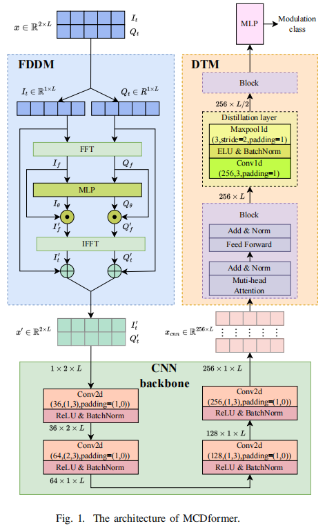

# MCDformer
Code for "Multi-Channel Convolutional Distilled Transformer
for Automatic Modulation Classification".

Zhenhua Chen, Xinze Zhang, Kun He

Huazhong University of Science and Technology



## Quick Start

### Prepare data

We conducted experiments on two datasets, namely RML2016.10a and RML2016.10b.

| dataset     | modulation formats                                           | samples              |
| ----------- | ------------------------------------------------------------ | -------------------- |
| RML2016.10a | 8 digital formats: 8PSK, BPSK, CPFSK, GFSK, PAM4, 16QAM, 64QAM, QPSK; 3 analog formats: AM-DSB，AM-SSB，WBFM | 220 thousand (2×128) |
| RML2016.10b | 8 digital formats: 8PSK, BPSK, CPFSK, GFSK, PAM4, 16QAM, 64QAM, QPSK; 3 analog formats: AM-DSB，WBFM | 1.2 million (2×128)  |

The datasets can be downloaded from the [DeepSig](https://www.deepsig.ai/). Please extract the downloaded compressed file directly into the `./Dataset` directory, and keep the file name unchanged. The final directory structure of `./Dataset` should is shown below:

```
Dataset
├── RML2016.10a
|    └──RML2016.10a_dict.pkl
└── RML2016.10b
    └──RML2016.10b.dat
```

### Train & Evaluate
```
python MCDformer/exp_config/rml16a.py
```
